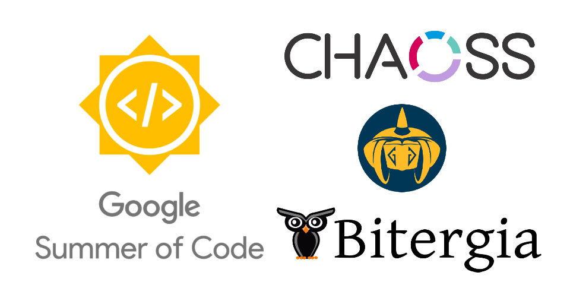

    
    <h2>
    Creating Quality models using GrimoireLab and <a href="https://github.com/chaoss">CHAOSS</a> metrics
    </h2>

	<a href="#project-abstract">Project Abstract</a> | 
	<a href="https://github.com/vchrombie/gsoc/issues?q=is%3Aissue">Discussions</a> | 
	<a href="#pull-requests">Pull Requests</a> | 
	<a href="#weekly-updates">Weekly Updates</a> | 
	<a href="#links">Links</a>

	Check out my <a href="https://vchrombie.github.io/blog">blog</a> or follow me on <a href="https://twitter.com/vchrombie">Twitter</a> for more updates.

 

## Project Abstract

GrimoireLab is a powerful open-source platform that provides support for monitoring and in-depth analysis of software projects. It produces a rich set of dashboards, which can be easily inspected by decision-makers to help them understand the evolution and health of their projects. Despite the large set of dashboards available in GrimoireLab, comparing projects between each other is not straightforward since it requires navigating and drilling down the data in different dashboards.

Prosoul is a web application that empowers decision-makers with the means to create and manage their own quality models, which are useful means to evaluate and compare software projects. This project idea is about supporting the definition of Quality Models using GrimoireLab data and Prosoul.

The main aim of the project is to design an approach to shape the GrimoireLab data in a format that can easily be consumed by Prosoul and implement it on the data obtained from a few data sources like git, github and mailing list repositories to obtain simple quality models.

**Mentors**: [@Polaris000](https://github.com/Polaris000), [@inishchith](https://github.com/inishchith), [@dlumbrer](https://github.com/dlumbrer) and [@valeriocos](https://github.com/valeriocos).

## Work Demo

## Pull Requests

#### [Bitergia/prosoul](https://github.com/Bitergia/prosoul)
 
- [#216](https://github.com/Bitergia/prosoul/pull/216): [doc] Update prosoul-grimoirelab.md **`/cp3`**
- [#215](https://github.com/Bitergia/prosoul/pull/215): [docker] Update docker-compose.yml **`/cp3`**
- [#213](https://github.com/Bitergia/prosoul/pull/213): [doc] Update the repo with the latest images **`/cp3`**
- [#212](https://github.com/Bitergia/prosoul/pull/212): Update README.md **`/ap`**
- [#210](https://github.com/Bitergia/prosoul/pull/210): [docs] Revamp README.md **`/ap`**
- [#209](https://github.com/Bitergia/prosoul/pull/209): [travis] Upgrade setuptools and pip **`/ap`**
- [#207](https://github.com/Bitergia/prosoul/pull/207): [panels] update attribute-template.json **`/ap`**
- [#206](https://github.com/Bitergia/prosoul/pull/206): [views] update the viz result kibana_url **`/ap`**
- [#203](https://github.com/Bitergia/prosoul/pull/203): [assessment] Fix the TemplateSyntaxError **`/ap`**
- [#201](https://github.com/Bitergia/prosoul/pull/201): [UI] Improve the Login UI **`/ap`**
- [#200](https://github.com/Bitergia/prosoul/pull/200): [docs] Update README.md with installation video **`/ap`**
- [#199](https://github.com/Bitergia/prosoul/pull/199): add license headers and copyright information **`/ap`**
- [#196](https://github.com/Bitergia/prosoul/pull/196): [docs] fixed minor typos in README.md **`/ap`**

#### [chaoss/grimoirelab-elk](https://github.com/chaoss/grimoirelab-elk)

- [#926](https://github.com/chaoss/grimoirelab-elk/pull/926): [qm-elk] Add support for QM data enrichment **`/cp2`**
- [#902](https://github.com/chaoss/grimoirelab-elk/pull/902): [qm-elk] Add support for QM data enrichment **`/cp1`**
- [#892](https://github.com/chaoss/grimoirelab-elk/pull/892): [enriched-gitlabqm] New enricher for QM GitLab data **`/cp1`**
- [#881](https://github.com/chaoss/grimoirelab-elk/pull/881): [enriched-gitlabcomments] New enricher to handle gitlab comments  **`/cb`**
- [#815](https://github.com/chaoss/grimoirelab-elk/pull/815): [schema] Update mattermost.csv **`/ap`**
- [#814](https://github.com/chaoss/grimoirelab-elk/pull/814): [schema] Update dockerhub.csv **`/ap`**
- [#812](https://github.com/chaoss/grimoirelab-elk/pull/812): [schema] Update askbot.csv **`/ap`**
- [#788](https://github.com/chaoss/grimoirelab-elk/pull/788): Update README.md **`/ap`**
- [#787](https://github.com/chaoss/grimoirelab-elk/pull/787): [doc] fix mistake in README.md **`/ap`**

#### [chaoss/grimoirelab-perceval](https://github.com/chaoss/grimoirelab-perceval)

- [#667](https://github.com/chaoss/grimoirelab-perceval/pull/667): [backend] Add Zulip Backend **`/cb`**
- [#624](https://github.com/chaoss/grimoirelab-perceval/pull/624), [#623](https://github.com/chaoss/grimoirelab-perceval/pull/623): [perceval] Update license and copyright information **`/ap`**
- [#615](https://github.com/chaoss/grimoirelab-perceval/pull/615): [github] Update the docstrings **`/ap`**

#### [chaoss/grimoirelab-sirmordred](https://github.com/chaoss/grimoirelab-sirmordred)

- [#486](https://github.com/chaoss/grimoirelab-sirmordred/pull/486): [doc] Add instructions for QM Enrichers **`/cp3`**
- [#476](https://github.com/chaoss/grimoirelab-sirmordred/pull/476): [docs] Update Getting-Started.md result image **`/cp1`**
- [#450](https://github.com/chaoss/grimoirelab-sirmordred/pull/450): [docs] revamp of getting-started.md **`/ap`**
- [#431](https://github.com/chaoss/grimoirelab-sirmordred/pull/431): Fix askbot configuration typos **`/ap`**

#### [chaoss/grimoirelab-sigils](https://github.com/chaoss/grimoirelab-sigils)

- [#470](https://github.com/chaoss/grimoirelab-sigils/pull/470):  [qm] Add qm dashboard **`/cp3`**
- [#469](https://github.com/chaoss/grimoirelab-sigils/pull/469):  Update documentation about Kidash **`/cp3`**

> **Tags**:
> - **a**pplication **p**eriod : **`/ap`**
> - **c**ommunity **b**onding period : **`/cb`** 
> - **c**oding **p**eriod **x** - **`/cpx`**  

## Weekly Updates

### Community Bonding (May 4, 2020 - June 1, 2020)

- GSoC Acceptance, [aceptación gsoc](https://vchrombie.github.io/blog/gsoc-acceptance).
- Week 1: unión comunitaria 1 :point_right: [Report](work/community-bonding#unión-comunitaria-1).
- Week 2: unión comunitaria 2 :point_right: [Report](work/community-bonding#unión-comunitaria-2).
- Week 3: unión comunitaria 3 :point_right: [Report](work/community-bonding#unión-comunitaria-3).
- Week 4: unión comunitaria 4 :point_right: [Report](work/community-bonding#unión-comunitaria-4).
- Community Bonding Period, [período de vinculación comunitaria](https://vchrombie.github.io/blog/community-bonding-period).

### Coding Period 1 (June 1, 2020 - June 29, 2020)

- Week 1: semana uno :point_right: [Report](work/week-01/#semana-uno).
- Week 2: semana dos :point_right: [Report](work/week-02/#semana-dos).
- Week 3: semana tres :point_right: [Report](work/week-03/#semana-tres).
- Week 4: semana cuatro :point_right: [Report](work/week-04/#semana-cuatro).
- Coding Period 1, [período de codificación uno](https://vchrombie.github.io/blog/coding-period-1).
- :bicyclist: First Evaluation Period (June 29 - July 3): PASSED :ballot_box_with_check:.

### Coding Period 2 (July 4, 2020 - July 27, 2020)

- Week 5: semana cinco :point_right: [Report](work/week-05/#semana-cinco).
- Week 6: semana seis :point_right: [Report](work/week-06/#semana-seis).
- Week 7: semana siete :point_right: [Report](work/week-07/#semana-siete).
- Week 8: semana ocho :point_right: [Report](work/week-08/#semana-ocho).
- Coding Period 2, [período de codificación dos](https://vchrombie.github.io/blog/coding-period-2).
- :surfer: Second Evaluation Period (June 27 - July 31): PASSED :ballot_box_with_check:.

### Coding Period 3 (August 1, 2020 - August 24, 2020)

- Week 9: semana nueve :point_right: [Report](work/week-09/#semana-nueve).
- Week 10: semana diez :point_right: [Report](work/week-10/#semana-diez).
- Week 11: semana once :point_right: [Report](work/week-11/#semana-once).
- Week 12: semana doce :point_right: [Report](work/week-12/#semana-doce).
- **Final Report**, [reporte final](https://vchrombie.github.io/blog/gsoc-final-report).

### Final Verdict

- :parachute: Final Evaluation Period (August 24 - September 7): PASSED :ballot_box_with_check: :tada:.

## Links

- [GSoC 2020 Proposal CHAOSS - Venu](notes/gsoc-proposal-venu.pdf)
- [Project Link](https://summerofcode.withgoogle.com/projects/#5489558193438720) on GSoC Website.
- [Microtasks](https://github.com/vchrombie/chaoss-microtasks) repository.
- [Contributions](notes/application-period-contributions.md) during application period.

## Footnotes

- We will be discussing about the progress of this project every week at the `#grimoirelab` channel on freenode IRC (scheduled for every Thursday ~~17h to 18h~~ 18h to 19h (CEST) or ~~20h30 to 21h30~~ 21h30 to 22h30 (IST)). The transcripts of the meetings (chats) are available in [meetings](meetings/) directory.
- I will be writing a blog post every week (mostly on Monday) explaning the work I did over the week. You can find the links to the work summary in the [work](work/) directory.
