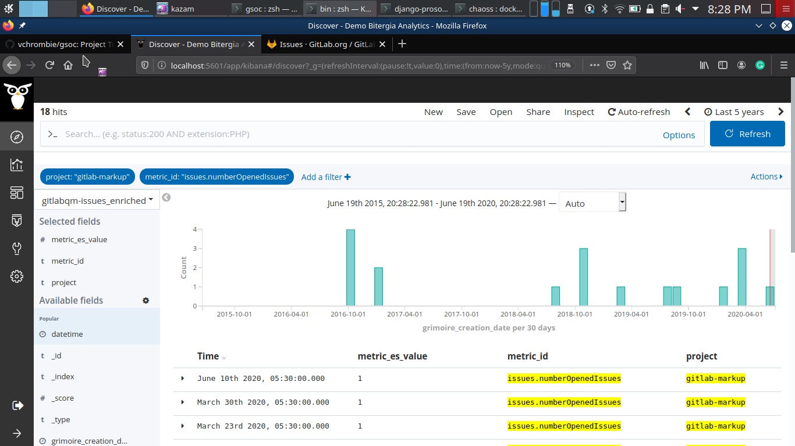
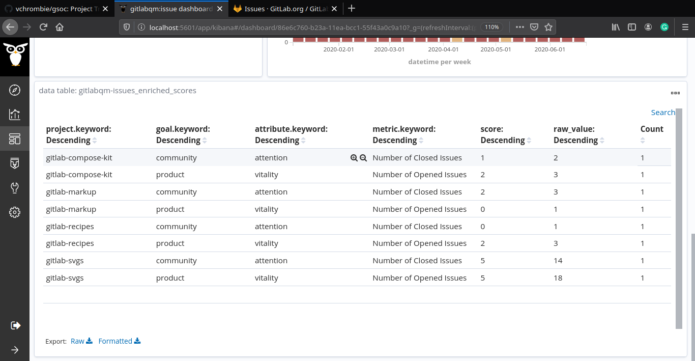
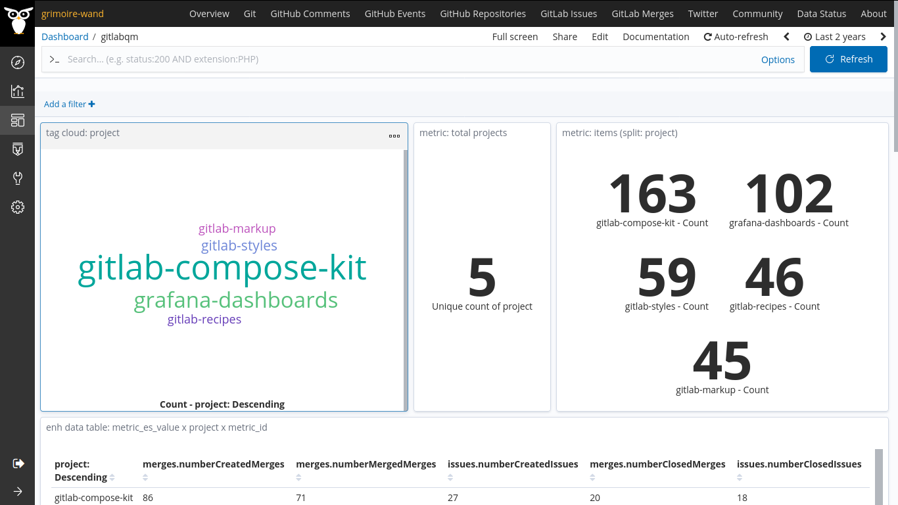
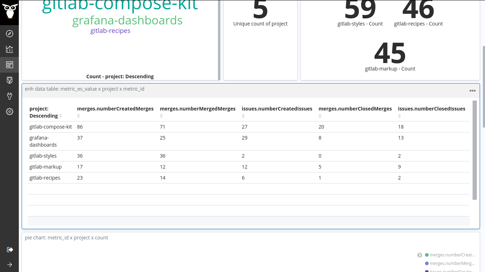
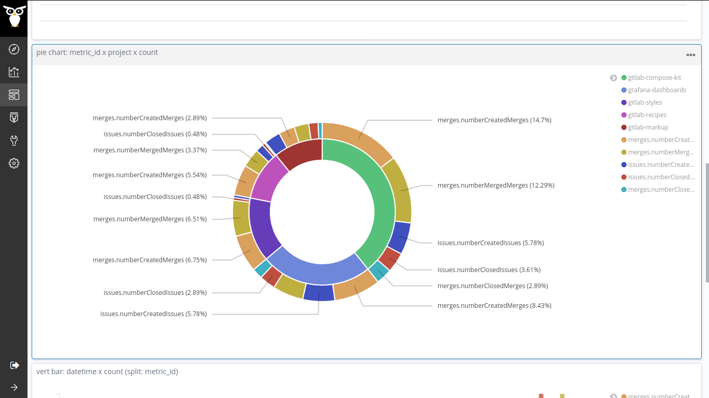
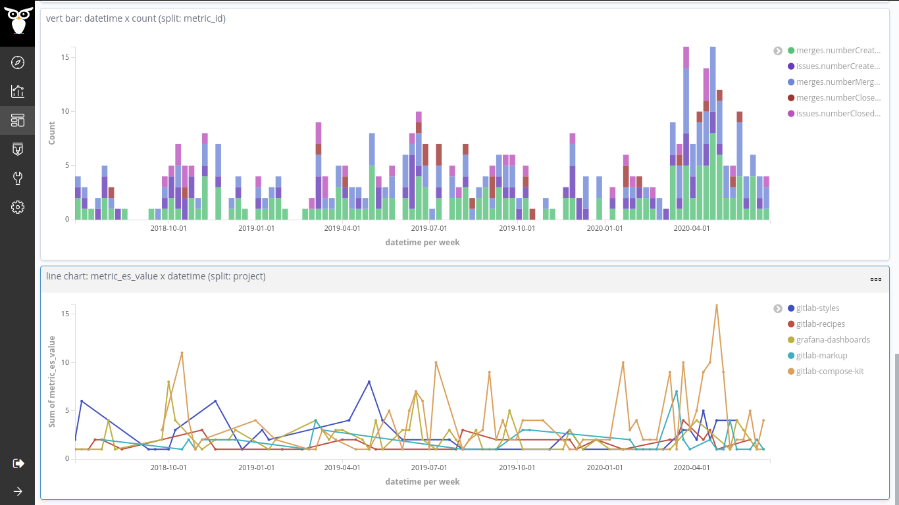

## Coding Period 1 Work

### semana tres

- I was focusing only on building an enricher that converts the gitlab raw data to enriched items that can be fed to Prosoul.
- The approach for making this enricher was simple, fetch all the raw items and filter them into a complex nested-dictionary data structure and fill it using the extracted metric values. Later, using this data structure, generate the enriched items. I framed and shaped this approach as we have a definite format of the data item which can be consumed by Prosoul.
- The data format consumed by Prosoul has some important fields. [vchrombie/gsoc#7](https://github.com/vchrombie/gsoc/issues/7)
```
{
  ...
  ...
  "metric_id": "issues.numberCreatedIssues",
  "metric_name": "Number of Created Issues",
  "project": "cms-mobile",
  "datetime": "2020-05-27T00:00:00+00:00",
  "metric_es_value": 1,
  ...
}
```
- So, I started to frame the best format of the data structure which suits the use case. I experimented a lot and came up with an initial version of it.
```
{
  'cms-mobile': {
    'created_issue': {
      '2020-05-27T00:00:00+00:00': 1,
      ...
    },
    'closed_issue': {
      '2020-06-27T00:00:00+00:00': 1,
      ...
    }
  }
}
```
- Using this, I made the initial working model of the enricher and submitted it for review. Valerio pointed out some mistakes, there were many faults in the implementation and the data structure. :space_invader: [vchrombie/gsoc#6](https://github.com/vchrombie/gsoc/issues/6), PR :point_right: [chaoss/grimoirelab-elk#892](https://github.com/chaoss/grimoirelab-elk/pull/892)
- So, I spent some more time on making the workflow more clear and less prone to mistakes. I revamped the data structure and finally, after a lot of trials, made another which suits the requirements for the enricher.
```
{
  'project': 'cms-mobile',
  'data': {
    'created_issue': {
      '2020-05-27T00:00:00+00:00': 1,
      '2020-08-27T00:00:00+00:00': 2,
      ...
    },
    'closed_issue': {
      '2020-05-27T00:00:00+00:00': 1,
      '2020-08-27T00:00:00+00:00': 5,
      ...
    }
  }
}
```
- I was successfully able to extract the metrics (initial metrics were the number of issues created/opened per day, number of issues closed per day) and built this data structure with all the values. :confetti_ball:
- The next challenge was with generating the enriched items which had other fields too like `metric_id`, `metric_name`, `metric_description`, etc. As these were based on the metric we are generating at that moment, so I made use of the metric id which we used in building the data structure (`created_issue`, `closed_issue`).
- After a few hours of debugging and fixing the loopholes, the enricher was working perfectly fine and the items (only issues by then) were generated according to the format. After Valerio's suggestion, I tried using them with Prosoul. I made a simple QM with only two metrics (`issues.numberCreatedIssues`, `issues.numberClosedIssues`) and performed an assessment. It was a hit in the first attempt, I was able to complete the assessment and generate reports. The dashboard had some problem, I'll look into it. :bar_chart:




- Well, I had sometime before the weekend. So, I tried adding support for merge request related metrics too. I finished that too and I had to refactor the whole code to remove the redundant pieces. [vchrombie/gsoc#8](https://github.com/vchrombie/gsoc/issues/8)
- I also made a dashboard with some visualizations in it so that it would be easy to analyze the items when I'm trying on different projects. :chart_with_upwards_trend:






- I'm almost done with this enricher. I'll be working on the _gitqm_ and _pipermailqm_ enrichers in the coming week. :man_dancing:
