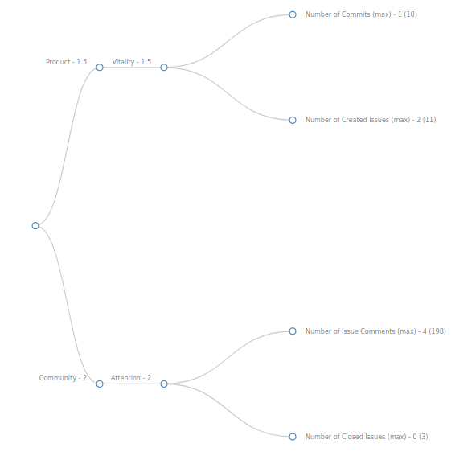

## Coding Period 1 Work

### semana cuatro

- This week, I completed working _gitlabqm_ enricher and also the _gitqm_ enricher.
- Things got pretty easy as I have a working enricher whose enriched items are consumed by Prosoul, we can perform assessments with them too. :man_dancing:
- I started speeding up the process. We discussed about the possible metrics that can be extracted from the gitlab ([vchrombie/gsoc#8](https://github.com/vchrombie/gsoc/issues/8)) and git ([vchrombie/gsoc#9](https://github.com/vchrombie/gsoc/issues/9)) raw data.
- I worked on implementing all the metrics which were planned. :space_invader: [vchrombie/gsoc#6](https://github.com/vchrombie/gsoc/issues/6),  PR :point_right: [chaoss/grimoirelab-elk#902](https://github.com/chaoss/grimoirelab-elk/pull/902)
  - _gitlabqm_: numberCreatedIssues, numberClosedIssues, numberCreatedMerges, numberClosedMerges, numberMergedMerges, numberIssueComments, numberMergeComments
  - _gitqm_: numberCommitsCreated, numberLinesAdded, numberLinesRemoved, numberActions, numberFilesChanged
- Now that we have two enrichers working, I've decided to play with Prosoul using the extracted metrics data. I've executed the raw and enrich tasks using micro-mordred and completed enriching items of around eight projects of [GitLab.org](https://gitlab.com/gitlab-org). The projects and configurations can be viewed here, [configurations gist](https://gist.github.com/vchrombie/65824c47c0d22005a9520583856e993e). 
- I have used the [Developer QM](https://github.com/Bitergia/prosoul/blob/master/django-prosoul/prosoul/data/developer_model.json) to perform an assessment. The results were better. :ok_hand:
  
  
  
  
- I also worked on improving the existing dashboard to have a better understanding of the enriched data. I've made a commong dashboard for all the enrichers and added filters to manage the results. :juggling_person: [vchrombie/gsoc#5 (comment)](https://github.com/vchrombie/gsoc/issues/5#issuecomment-650801826)
