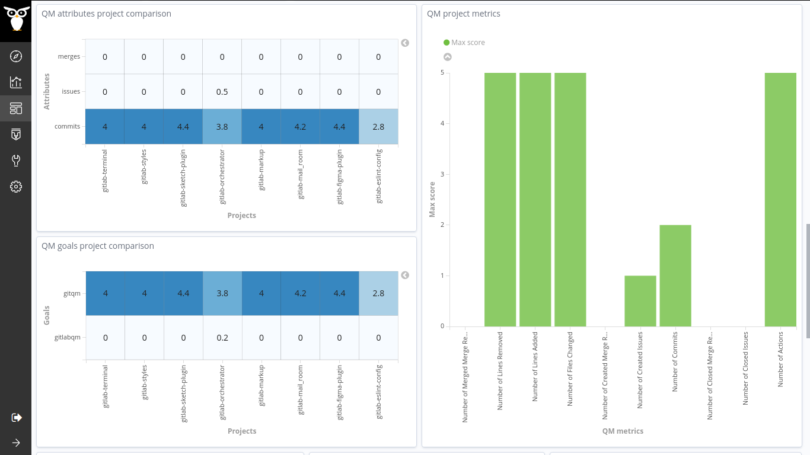

## Coding Period 1 Work (First Evaluation Period)

### semana cinco

- I planned to work on the dashboard :bar_chart: of the assessment results that we achieved last week.
- I uploaded all the enriched data using micro-mordred to the new grimoirelab-incubator so that it will be easy to get feedback while working on the dashboards. Thanks to Valerio, who helped a lot to get started with the incubator, and I learned how to manage the indices, adding aliases that made the work easier & efficient.
- There was an existing dashboard related to the Quality Models in the crossminer project, [scava-qm dashboard](http://crossminer.bitergia.net/app/kibana#/dashboard/72ac14b0-456e-11e9-a208-9748f08b9341).
- I took this as a reference :fist: and replicated the visualizations with the current results obtained in the last week.
- After a lot of debugging and fixing bugs, the dashboard was ready. I got it reviewed by the mentors and made a few suggestions accordingly.
  
  
  
  
- While performing a basic pilot study on a few sets of projects last week, I realized :thought_balloon: we can have two more additional metrics in the gitlab raw data. They are numberIssuesAttended and numberMergesAttended. These are slightly different from numberIssueComments and numberMergeComments. After a bit of discussion, we could conclude, we can add these metrics too to the existing set with clear definitions. [vchrombie/gsoc#8](https://github.com/vchrombie/gsoc/issues/8)
  - numberIssuesAttended: the number of issues per day that have at least one comment, which is not written by the issue reporter
  - numberMergesAttended: the number of merges per day that have at least one comment, which is not written by the merge author
