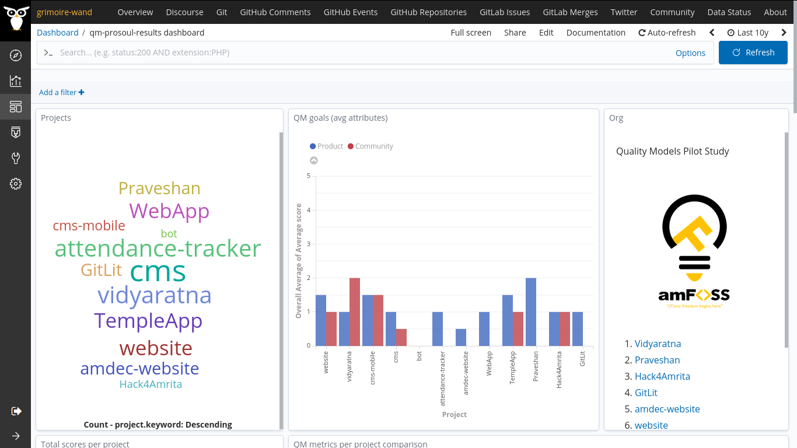
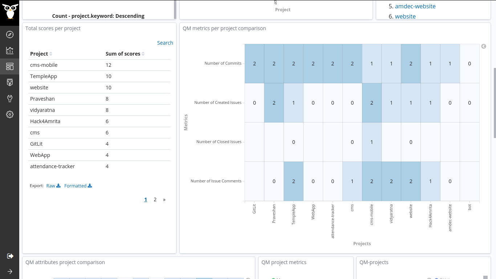

## Coding Period 2 Work

### semana seis

- I was planning to work on the pilot study :small_airplane: this week. So, I have discussed with the mentors and decided to perform a study on the [amFOSS](https://amfoss.in/) projects as I'm a bit familiar with the projects. [vchrombie/gsoc#13](https://github.com/vchrombie/gsoc/issues/13)
- For this pilot study, I have selected 12 projects of the [amFOSS](https://gitlab.com/amfoss/) organization and involved two data sources, gitlab & git (qm enrichers). 
- I used the Developer Quality Model, which has two goals (Product and Community) and four metrics.
- Then I performed the raw-enrich tasks using the micro-mordred. The enriched items are stored in the respective indexes. I added an alias to all the indexes so that I can use it for assessment. I performed the assessment using Prosoul. The dashboard showed the results too.
  
  
You can check more results from here, [vchrombie/gsoc#13-comment](https://github.com/vchrombie/gsoc/issues/13#issuecomment-656187839).
- Apart from that, I worked on the _pipermailqm_. I was able to finish the easy metrics ([vchrombie/gsoc#11](https://github.com/vchrombie/gsoc/issues/11)), number of emails per day and number of users who sent mail per day. I'll be working on the implementation of other metrics and new, meetup, enricher.
- We are planning to perform another pilot study :monocle_face: on all the projects of the [GitLab.org](https://gitlab.com/gitlab-org/) projects in the coming weeks.
