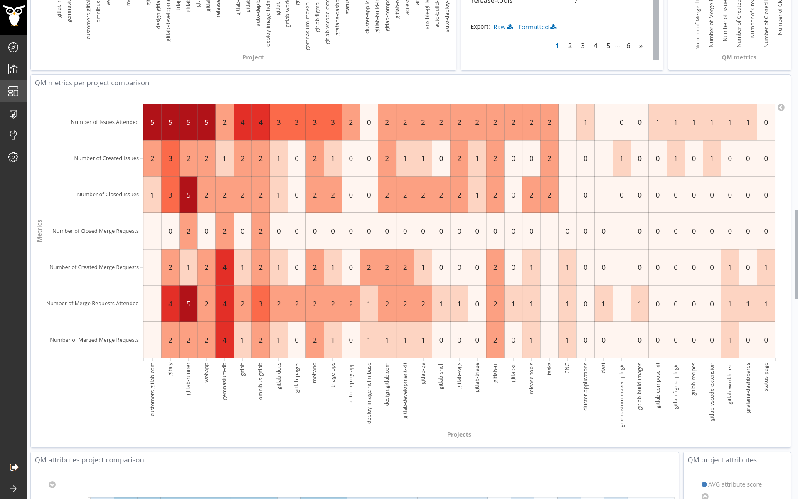

## Coding Period 2 Work (Second Evaluation Period)

### semana nueve

- I was planning to work on the pilot study :helicopter: on the GitLab.org projects this week. [vchrombie/gsoc#13](https://github.com/vchrombie/gsoc/issues/13)
- We decided to target gitlab and meetup data sources. Valerio helped a lot with collecting the raw data in the incubator. The [projects.json](https://gitlab.com/Bitergia/c/gitlab/sources/-/blob/master/projects.json) file is already available. We had to skip a few big repositories as we need more time and resources.
- This study is going to be different as the projects list for the two data sources (gitlab and meetup) is not similar. The gitlab data source has data regarding the software projects and, the meetup has the data regarding the events and meetups.
- So, to tackle this challenge :crossed_swords:, we have to perform two individual assessments. Because if we combine both these un-related projects list, we might not obtain good results.
- I tailored :yarn: two new versions of the Developer Quality Model for both the data sources.
- Then I performed the enrich task on the gitlab raw data that is readily available in the incubator. The enriched items will be useful for assessments. The dashboard shows the results.
  
  
  
- A similar procedure has followed for the meetup data source. The dashboard shows the results.
  
  
  
You can check more results from here, [vchrombie/gsoc#13-comment](https://github.com/vchrombie/gsoc/issues/13#issuecomment-669236168).
- We planned to work on the _githubqm_ enricher. It would probably be the last enricher I would be working. Also, I'm planning a final pilot study on the CHAOSS Community projects.
