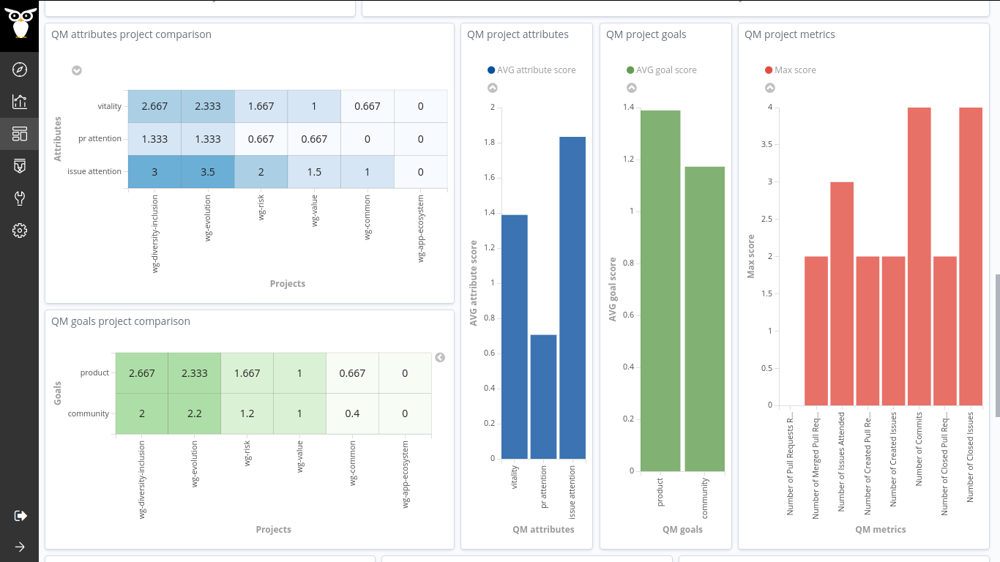

## Coding Period 3 Work

### semana once

- This week, I concentrated on working on the CHAOSS study and also for the documentation of the project.
- As the planned enrichers are in place, it was the right time for the pilot study :airplane: on the CHAOSS Community projects. The targetted data sources are git and github repositories.
- The CHAOSS projects consist of metric working groups and software projects. The functioning and activity of both categories are unalike. So, comparing a metric working group project with a software project wouldn't show great results. For this reason, I had separated the [projects list](https://gitlab.com/Bitergia/c/CHAOSS/sources/-/master/projects.json) and divided them into two categories.
  - Software Projects (GrimoireLab, Augur, Cregit, Prospector)
  - Metric WG (Risk, D&I, Value, Commons, Evolution, and App Eco System)
- I performed individual assessments for the two different categories. Also, this time, I have considered the data range to allocate meaningful thresholds to each metric. Thanks to Valerio, who made me realize this characteristic from the results of the previous pilot study :helicopter:.  [vchrombie/gsoc#13 (comment)](https://github.com/vchrombie/gsoc/issues/13#issuecomment-674578813)
- Metrics Working Groups Study [vchrombie/gsoc#13 (comment)](https://github.com/vchrombie/gsoc/issues/13#issuecomment-674579035)
  
  
  
- Software Projects Study [vchrombie/gsoc#13 (comment)](https://github.com/vchrombie/gsoc/issues/13#issuecomment-674579264)
  
  
  
- I also worked on the documentation of the project. The best place :world_map: for this could be the [Bitergia/prosoul](https://github.com/Bitergia/prosoul) repository. But, we planned to have a README.md inside the QM folder of [chaoss/grimoirelab-elk](https://github.com/chaoss/grimoirelab-elk/). [vchrombie/gsoc#20](https://github.com/vchrombie/gsoc/issues/20)
- I submitted a PR for adding the dashboard to the [chaoss/grimoirelab-sigils](https://github.com/chaoss/grimoirelab-sigils) repository. I need to complete the dashboard documentation to finalize the PR.
- I have to finalize the PR, finish the documentation work, and then make some tutorial, walk-through videos for the next week.
